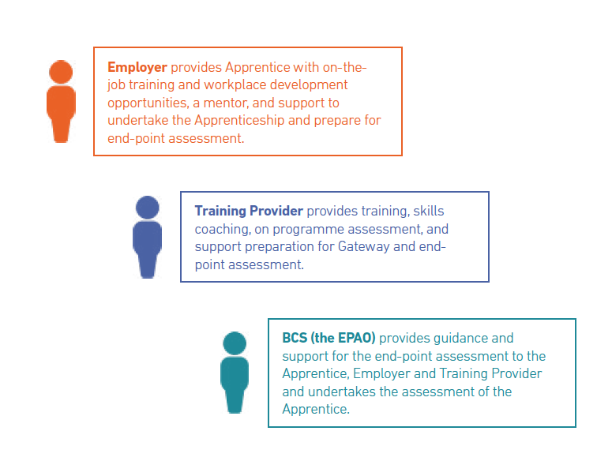

{: .no_toc }

# EPA Roles & Responsibilities

<iframe src="https://solent.cloud.panopto.eu/Panopto/Pages/Embed.aspx?id=cca7cbd3-4963-45ad-823b-ae860125bbef&autoplay=false&offerviewer=true&showtitle=true&showbrand=true&captions=true&interactivity=all" height="405" width="720" style="border: 1px solid #464646;" allowfullscreen allow="autoplay"></iframe>

[Download Slides](../info/Data Analyst Webinar - What assessment looks like.pdf)

### Apprentice
* Understand the purpose and importance of EPA and undertake EPA.
* Participate in development opportunities to improve their knowledge, skills, and behaviours in line with the requirements of the Standard.
* Meet all gateway requirements when advised by the employer.

### Employer
* Support the apprentice to achieve the KSBs outlined in the standard. Determine when the apprentice is working at or above the level outlined in the standard and is ready for EPA.
* Ensure the apprentice is well prepared for the EPA.
* Select the EPAO.
* Confirm arrangements with EPAO for the EPA (who, when, where) in a timely manner.

### Solent University - Training Provider
* Ensure the apprentice is on the correct standard for their job role by mapping and assessing their work against the standard.
* Work with the employer to ensure that the apprentice is given the opportunities to develop the KSBs outlined in the standard and monitor their progress during the on-programme period.
* Advise the employer, upon request, on the apprentice’s readiness for EPA prior to the gateway.
* Advise the employer and the apprentice on which relevant training and activities are most appropriate for their requirements and agree on a suitable training plan.
* Assist the apprentice with applying knowledge in the workplace.
* Act as an advisor to the apprentice and the employer to ensure the programme remains on track and any concerns are addressed.
* Help the apprentice to select evidence for their portfolio (if required). Support the apprentice through their assessments.
