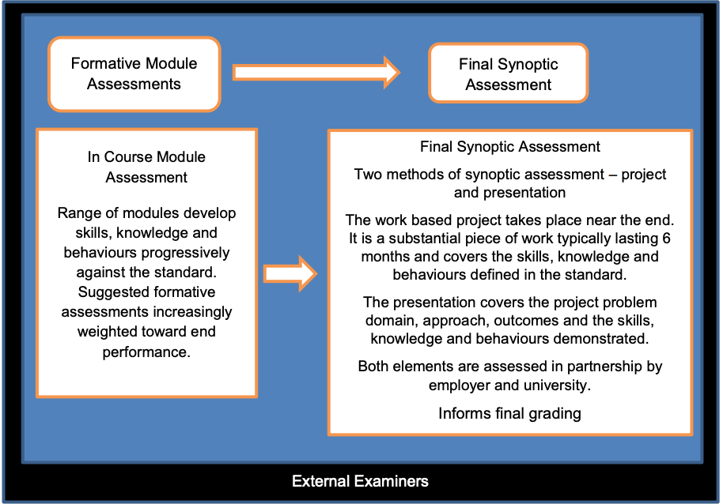

{: .no_toc }

#  BDATS - End Point Assessment (EPA)

Solent University, East Park Terrace, Southampton, SO14 0YN   **[End Point Assessor Organisation (EPAO) ID: EPA0325](https://assets.publishing.service.gov.uk/government/uploads/system/uploads/attachment_data/file/1023443/Register_List_Of_Organisations_Oct_2021.xlsx)**

**You will work on your work based Synoptic Project in the final on programme module COM625 before moving into Gateway EPA in the final three months of the apprenticeship, in this time you will prepare for your presentation to the independent assessor and upload your completed annotated portfolio that will map to knowledge skills and behaviours of the [standard.](https://www.instituteforapprenticeships.org/apprenticeship-standards/digital-and-technology-solutions-professional-integrated-degree/)**

**You need to be employed as an apprentice to do the EPA assessment**Following information has been derived from the [assessment plan](https://www.instituteforapprenticeships.org/media/1073/digital_and_technology_solutions_professional.pdf)

**Assessment Overview**  
The delivery of the apprenticeship by the university provides an integrated approach to developing and assessing skills and knowledge across the range of modules in the degree programme. Each university will develop its own degree programme and will map the individual modules to the outcomes in the standard. Individual modules will contribute formative assessment to the skills, knowledge and behaviour outcomes en-route to the final synoptic project and presentation. The final synoptic project is a substantial piece of work, typically taking around 6 months to undertake alongside the apprentices normal duties to their employer. The endpoint assessment integrates the project outcomes and presentation into the overall synoptic project assessment. It is this endpoint assessment that will be judged against the standard, and test the skills, knowledge and behaviours together as applied through the project.

### Synoptic project assessment
  
The synoptic project is a work based project that broadly represents the skills, knowledge and behaviours in the standard. The project will provide substantive evidence from a business-related project to demonstrate the application of skills and knowledge. The endpoint assessment integrates the project outcomes and presentation into the overall synoptic project assessment. It will take place over a period of around 6 months, near the end of the programme. It is designed to assess apprentices in a consistent way, irrespective of their particular workplace and university. Because of the significance of the project the employer and university should work together with the apprentice to agree a project that is achievable within the employer’s business constraints and that meets the requirements of the standard. The project should be conducted as part of the apprentice’s normal work. Employers should make suitable allowance for the project to be undertaken, both in terms of time and resources. However, there are some elements such as the writing of the report, particularly in its reflective aspects that may be undertaken outside of normal work. This should be agreed between apprentice, employer and university such that apprentices are not disadvantaged in any way from performing their job and meeting the requirements of the project.

**Any issues with confidentiality and/or security will also be addressed between the university, employer and apprentice allowing for projects of business value to be undertaken using real data.**

The assessment of the synoptic project should include the employer’s assessment against the common criteria for the project. Every project assessment is required to incorporate employer contribution in addition to normal university project assessment. This needs to be consistent for all projects.  
  
The project should relate to one of the specialisms in the standard. High-level descriptors of typical projects are given below for each of the specialisms in the standard.  
  
**Software Engineer**  
This could be a project to design and develop a significant piece of software or a new software product prototype to achieve defined business objectives, for a defined user group or customer group, to meet the business need and applying appropriate levels of security. It will include significant project planning including estimations of both time and cost to proposed solutions, include technical and commercial aspects of the proposed solution.

**IT Consultant**  
This could be a project to undertake an IT consultancy project to formulate and evaluate technical alternatives to meet businesses requirements. This will likely include issues of integration with existing technology and procedures, maintenance and expansion and the consideration of both proprietary and open source solutions as appropriate. It will include significant project planning including estimations of both time and cost to proposed solutions, include technical and commercial aspects of the proposed solution.  
  
**Business Analyst**  
This could be a Business Analysis study to analyse, and model a problem-specific domain and to develop a solution approach based upon the analysis. It will include significant project planning including estimations of both time and cost to proposed solutions, include technical and commercial aspects of the proposed solution.  
  
**Cyber Security Analyst**  
This could be an analysis of a given domain and evaluation of security threats and vulnerabilities to planned and installed information systems or services with a robust cyber security solution. It will include significant project planning including estimations of both time and cost to proposed solutions, include technical and commercial aspects of the proposed solution.

**Data Analyst**  
This could be a project to analyse, devise and deploy data analytics solutions for a real-world problem domain. In particular, applying data analysis techniques, processes and tools to perform analytics for a significant data-driven business scenario. It will include significant project planning including estimations of both time and cost to proposed solutions, include technical and commercial aspects of the proposed solution.  
  
**Network Engineer**  
This could be a project to plan and configure a network to meet a defined specification, to satisfy security requirements, using one or more of the defined tools, to meet specified criteria and performance levels. It will include significant project planning including estimations of both time and cost to proposed solutions, include technical and commercial aspects of the proposed solution.  
  

#### Generic Content of the Synoptic Project

Each project must enable the following to be demonstrated:

* the application of the core and specialism knowledge and skills to meet the outcomes in the standard;
* the approach to planning and completion of the project;
* the application of behaviours from the standard.

  
The project will cover all of the specialism skills, knowledge and behaviours as defined in the standard. The project will cover the specialism skills, knowledge and behaviours from the standard using the occupational domain to select the project as follows:  
  

* **Software Engineer:** Show competence in software development processes, including the knowledge, skills, and professional competences necessary to practice as a software engineer in a business environment.  
      
    
* **IT Consultant:** Perform technical, organisational, and process improvement tasks in a range of environments to solve business problems.  
      
    
* **Business Analyst:** Apply structured processes for identifying, defining and analysing unstructured business problems, their root cause and impact.  
      
    
* **Cyber Security Analyst:** Analyse and evaluate security threats and vulnerabilities to planned and installed information systems or services and identify how these can be mitigated against.  
      
    
* **Data Analyst:** Use a range of analytical techniques such as data mining, time series forecasting and modelling techniques to identify and predict trends and patterns in data.  
      
    
* **Network Engineer:** Plan, design, build and test a simple network to a requirement specification that includes hubs, switches, routers and wireless user devices applying appropriate security products and processes.  

#### Practical Requirements for the design of Synoptic Projects

* Agreement to be made between apprentice, employer and university on what systems, tools and platforms will be required to complete the task and how these will be made available.
* Specification of what has to be delivered on completion of the project – must include the output, documented project plans etc.
* Apprentices are required to document their assumptions and to highlight the consequences of those assumptions – enabling them to show their understanding of commercial pressures, and the application of their thinking and problem solving skills.
* Terms of reference developed by the apprentice and agreed by the university and employer early in the project.
* University to provide clear project assessment criteria including terms of reference, approach to the problem, the design of the solution, the implementation of the solution, the final report and presentation etc.

####  Practical Requirements for the delivery of Synoptic Projects

* Universities will work with the employer and apprentice to agree suitable project title and support arrangements for the project to be undertaken.
* The project should normally be based an agreed business problem that forms part of the apprentices role.
* Suitable time should be set aside by the employer for the apprentice to plan, undertake and write up their project.
* For each project the apprentice will first work out what is required and present terms of reference and an initial plan for agreement across employer, apprentice and university.
* The project will be typically undertaken at the employer’s premises as agreed with the employer.
* The employer and university to ensure the apprentice has access to the specified systems, tools and platforms to complete the task.
* The apprentice to provide a signed statement to confirm it is his/her own work.
* Whilst other projects may typically be included during the programme, the synoptic project will be set and completed in the final year of the apprenticeship near the end of the programme.  
      
    

#### Practical Requirements for the project environment

* A suitable project environment should be provided ensuring access to all required tools, systems etc. This may be the apprentice’s normal workstation or maybe another environment as appropriate to the nature of the project.
* Someone responsible for managing the project from the employer perspective.
* The university project tutor will oversee and provide support to the apprentice.

###  The Presentation

The presentation is a structured discussion between the apprentice and their university lecturers and employer, focusing on the outcomes of the synoptic project. It covers both what the apprentice has done, the standard of their work, and also how they have done it. Typically this is the approach taken in university individual projects. This enables the assessment to include the assessment of skills, knowledge and behaviours as required by the standard.  
  
**The purpose of the presentation is to review:**

* what the apprentice set out to achieve;
* what they have actually produced in the project;
* the standard of their work;
* how they have approached the work and dealt with any issues arising;
* clarify any questions the university/employer has from their assessment of the project;
* explore aspects of the project work, including how it was carried out, in more detail;
* confirm the demonstration of appropriate interpersonal and behavioural skills.

  
The presentation will be assessed as part of the overall project assessment. The university will provide guidance on the nature of the presentation and the assessment criteria used. This will ensure that consistent approaches are taken and that all key areas are appropriately explored. The initial and primary focus for the presentation is on the work presented in the project. However, the presentation assessors can explore the apprentice’ broader experience from the workplace, to demonstrate that the skills and knowledge defined in the standard have been met.  
  
**Practical Requirements for the Presentation**

* The presentation will take place following the completion of the project and the preparation of the final report.
* The apprentice should have appropriate notice of their presentation time and have at least seven days’ notice.
* A structured brief will be used to support the presentation to ensure a consistent approach.
* The presentation and Q&A will typically last 30 minutes – and no more than one hour.
* The presentation will be conducted face to face or in exceptional circumstances via live media.
* The presentation will be conducted in a suitable location that allows for the project outcomes to be demonstrated. This may be at the university or employer location as appropriate.
* The university must put the apprentice at ease and give the apprentice the opportunity to do his/her very best.
* The presentation is to university module assessor(s) and the employer at the same time.

