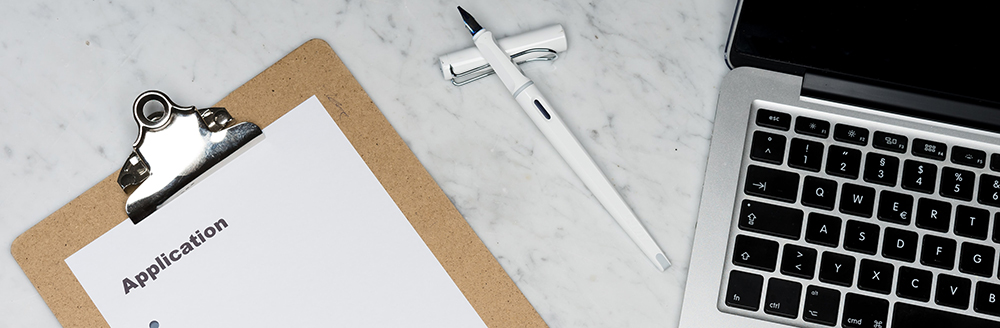

{: .no_toc }

# Record of Prior Learning (RLP)

 
The admissions tutor for apprenticeships will discuss prior learning at the interview and give all the information needed to complete the form.

Once an apprentice has completed the form and created appendices of evidence this will be checked by the admissions tutor before being passed on to Student Registry where it will go to a panel who will review the evidence and the documentation offered before making their decision