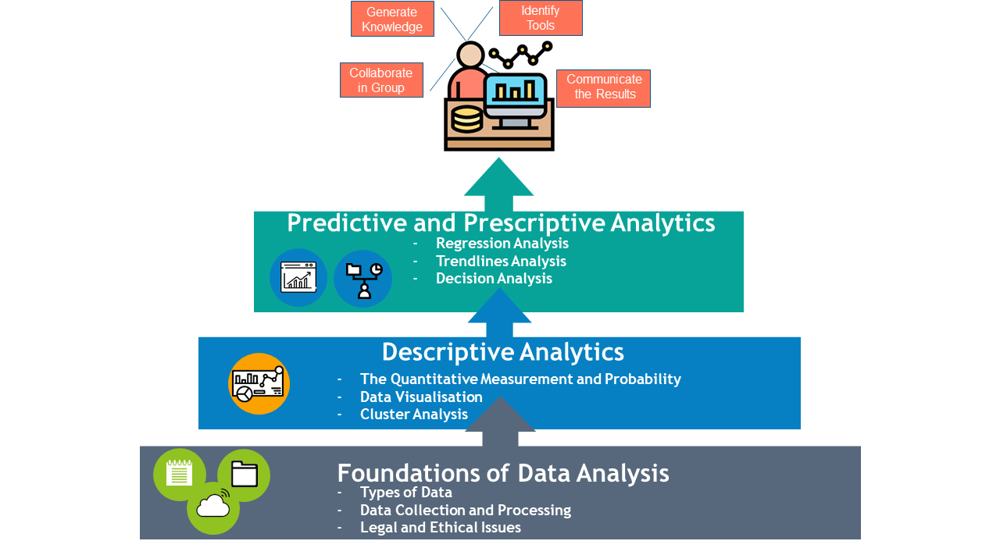

{: .no_toc }

# Data Analysis, Tools & Application COM418

**By the end of this module you will be able to:**

1. Identify appropriate tools and techniques for data analysis, data visualisation and presentation.

1. Carry out small-scale research, information gathering and data collection to generate knowledge to support the project with some guidance.
1. Discuss the use of relevant data analysis tools.

1. Collaborate in groups on projects and work on each step of the data life cycle.

1. Summarise and present the results of data analysis to a range of stakeholders making recommendations.

1. Communicate and summarise and present the results of data analysis to a range of stakeholders making recommendations.

The Data Analysis, Tools and Application module consists of three parts:

**Part 1: Foundations of Data Analysis**

* Types of Data
* Data collection and Processing
* Legal and Ethical Issues

**Part 2: Descriptive Analytics**

The Quantitative Measurement and Probability
Data Visualisation
Cluster Analysis

**Part 3: Predictive and Prescriptive Analytics**

* Regression Analysis
* Trendlines Analysis
* Decision Analysis

We use Microsoft Excel and PowerBI desktop for the delivery. Our students will build up their analysis skill using ranging of tools in Excel together with visualising data using PowerBI. in Excel together with visualising data using PowerBI.

