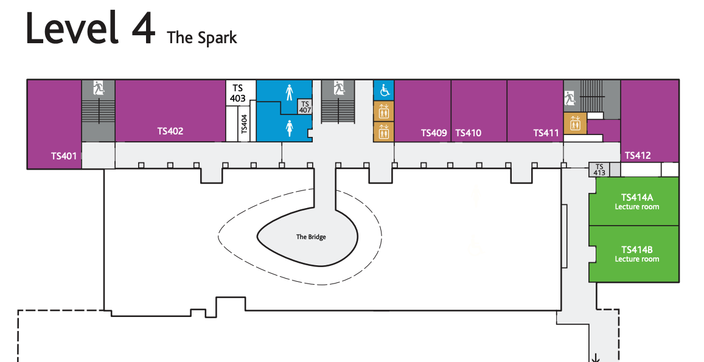

{: .no_toc }

# Induction

Apprenticeship induction takes place on campus two weeks before the start of term. Induction day is an opportunity for apprentices to meet tutors, learn more about delivery of the course and an opportunity to tour the campus.

**Tuesday 13th September 2022 - 9:00 - 13:00 - Room: Spark Building TS412**

### Campus: East Park Terrace, Southampton SO14 0YN

[solent.ac.uk/about/find-us](https://www.solent.ac.uk/about/find-us)

<iframe src="https://www.google.com/maps/embed?pb=!1m18!1m12!1m3!1d2515.8322225061675!2d-1.402574148061115!3d50.908320479440754!2m3!1f0!2f0!3f0!3m2!1i1024!2i768!4f13.1!3m3!1m2!1s0x487476b1943c33e9%3A0x7b3d2a7c433db059!2sSolent%20University!5e0!3m2!1sen!2suk!4v1658263361358!5m2!1sen!2suk" width="600" height="450" style="border:0;" allowfullscreen="" loading="lazy" referrerpolicy="no-referrer-when-downgrade"></iframe>

[Spark Building Plan](https://github.com/martinsolent/solent_store/raw/main/the-spark-room-guide-and-map.pdf){: .btn .btn-purple }

### Last Year's Induction Presentation 2021-22

<iframe src="https://solent.cloud.panopto.eu/Panopto/Pages/Embed.aspx?id=b0b14943-b23a-4114-8a28-ada801008324&autoplay=false&offerviewer=true&showtitle=true&showbrand=true&captions=true&interactivity=all" height="405" width="720" style="border: 1px solid #464646;" allowfullscreen allow="autoplay"></iframe>

[Download Induction Slides](info/BDATS_HNC_INDUCTION_2022.pptx)[Spark Building Plan](https://github.com/martinsolent/solent_store/raw/main/the-spark-room-guide-and-map.pdf){: .btn .btn-purple }
