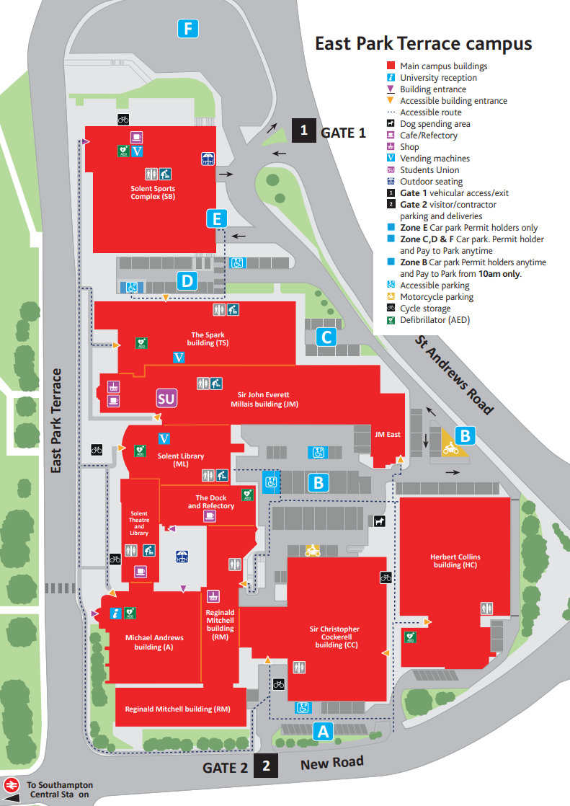

{: .no_toc }

# Induction

**Apprenticeship induction takes place on campus** a week before the start of term. Induction day is an opportunity for apprentices to meet tutors, learn more about delivery of the course and an opportunity to tour the campus. **For those who are unable to attend the Tuesday induction we prearranged with run your induction Thursday 16th Jan 2025 13:00-15:00 this will also be in JM413**

**Tuesday 14th January 2025 - 9:00 - 14:30 - Room: JM413**

**Directions JM413**:Take lift outside the Deli and Student Union Office to 4th Floor Sir John Everett Millais building (JM) Building.Turn left out of the lift. Follow the corridor.JM413 will be on the right.**See below**

[Download Induction Slides](info/Data-Analyst-Apprenticeship-jan-25.pptx)

9.00 Registration with Admissions

9.30 – 9.50 Apprenticeship team

* What is an Apprenticeship?
* Why are you special?
* Off the job trackers
* Progress reviews
* End Point Assessment
* Uni Buddy

10.00 - 10.15 Library Services

10.15 - 10.30 Access Solent

10.30 – 10.45 Solent Futures

11.00 – 11.15 Therapy and Mental Health

11.15 – 11.45 Safeguarding/Prevent

11.45 – 12.00 Students Union

**Break - 12:00-13:00**

13.00 - 14:30 Course Lead Induction & Campus Tour

### Campus: East Park Terrace, Southampton SO14 0YN

[solent.ac.uk/about/find-us](https://www.solent.ac.uk/about/find-us)

<iframe src="https://www.google.com/maps/embed?pb=!1m18!1m12!1m3!1d2515.8322225061675!2d-1.402574148061115!3d50.908320479440754!2m3!1f0!2f0!3f0!3m2!1i1024!2i768!4f13.1!3m3!1m2!1s0x487476b1943c33e9%3A0x7b3d2a7c433db059!2sSolent%20University!5e0!3m2!1sen!2suk!4v1658263361358!5m2!1sen!2suk" width="600" height="450" style="border:0;" allowfullscreen="" loading="lazy" referrerpolicy="no-referrer-when-downgrade"></iframe>

