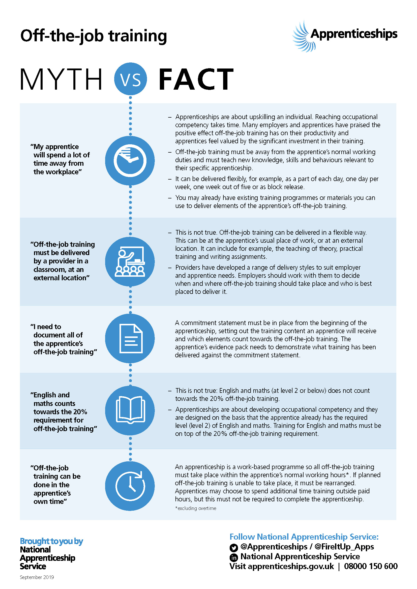

{: .no_toc }

# Apprenticeships: off-the-job training

Off-the-job training is a statutory requirement for an English apprenticeship and must make up at least 20% of an apprentice’s normal working hours (paid hours excluding overtime) over the planned duration of the apprenticeship.

It is training that is received by the apprentice, during the apprentice’s normal working hours, for the purpose of achieving the knowledge, skills, and behaviours of the approved apprenticeship referenced in the apprenticeship agreement.

<iframe src="https://solent.cloud.panopto.eu/Panopto/Pages/Embed.aspx?id=98b43793-d754-413e-91fe-adc4012d443f&autoplay=false&offerviewer=true&showtitle=true&showbrand=true&captions=true&interactivity=all" height="405" width="720" style="border: 1px solid #464646;" allowfullscreen allow="autoplay"></iframe>

***How employers and training providers should meet the 20% off-the-job training requirement for apprentices, with some best practice examples.***

**GOV.UK., 2020.** Apprenticeships: off-the-job training [viewed 2 October 2020]. 
Available from: [https://www.gov.uk/government/publications/apprenticeships-off-the-job-training](https://www.gov.uk/government/publications/apprenticeships-off-the-job-training)

During their apprenticeship, your apprentice will receive two different types of training.

‘Off-the-job’ training is delivered by a training provider during your apprentice's normal working hours.

This training will teach your apprentice the knowledge, skills and behaviours set out in the apprenticeship standard so they can achieve occupational competence.

‘On-the-job’ training will be delivered by you, as the employer. You'll need to give your apprentice training and supervision to help them perform the job you've hired them for.

### Off-the-job training
Apprentices must spend at least 20% of their working hours completing off-the-job training.

It can be flexible and doesn’t have to mean 1 day out of the workplace every week.

For example, training could take place:

* online
* at the apprentice’s place of work
* at a college or university or with a training provider
* Or it could be a combination of these options.

The frequency can vary, for example:

* 1 day a week
* part of a working day
* blocks of time
* For instance, some apprenticeships begin with a block of training to get the apprentice work-ready.

You can agree on a suitable training schedule to suit the needs of your business with your training provider.

### English and maths
Your apprentice may also need to study for maths and English qualifications as part of their apprenticeship.
You must allow your apprentice time to study for this within their normal working hours.
Studying English and maths is not counted as part of the 20% minimum off-the-job training requirement.

### Apprenticeship Commitment Statement
You must also sign an apprenticeship commitment statement with your apprentice and the training provider.

This must include:

the planned content and schedule for training
what is expected and offered by the employer, the training organisation and the apprentice
how to resolve queries or complaints

**APPRENTICESHIPS.GOV.UK., 2020.** Training your apprentice [viewed 2 October 2020].
Available from: [https://www.apprenticeships.gov.uk/employers/training-your-apprentice#](https://www.apprenticeships.gov.uk/employers/training-your-apprentice#)

[Off-the-job training mythbusters](https://assets.publishing.service.gov.uk/government/uploads/system/uploads/attachment_data/file/831594/Off-the-job-Myths-Facts-130919.pdf)

