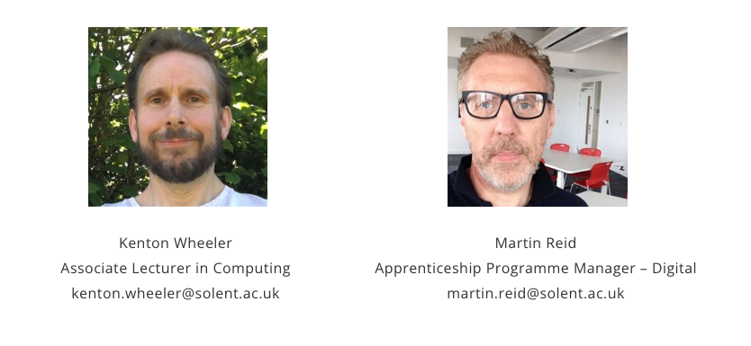

{: .no_toc }

# Apprenticeships - Reviews

Tripartite review meetings take place regularly throughout the apprenticeship and usually take place every 12 weeks (approx.)

At tripartite review meetings the apprentice, their employer, and an academic formally meet to assess progress and ensure that the apprentice is on track both in terms of their academic programme and their work-based learning. 

The review meetings will track progress against the knowledge, skills and behaviours gained in the apprenticeship.  They provide an opportunity to agree on any changes required to the apprentice’s learning plan and identify any actions needed to ensure the success of the apprenticeship.

Review meetings are undertaken by Kenton Wheeler and Martin Reid

[Download Review Form Template UPDATED JUNE 2022](https://github.com/martinsolent/solent_store/raw/main/docs/APPRENTICESHIP%20REVIEW%20FORM%202022.docx)

It's essential that an apprentice and the manager complete the sections and the apprentice has uploaded the review template on SOL prior to the meeting taking place or at the very latest within the meeting itself. We will then go through the sections within the meeting.

We have updated the form to include “wet signature” the method we are using is a little bit crude; it's just uploading an image of your signature details of how to do this can be found [here](https://github.com/martinsolent/solent_store/raw/main/docs/How%20to%20create%20a%20signature%20and%20insert%20into%20MS%20Word.docx) It might be an idea you pre-populate the template with your signatures for future use

## Review meeting workflow

<iframe src="https://solent.cloud.panopto.eu/Panopto/Pages/Embed.aspx?id=745622f5-c9d1-4561-8d1e-aecc0117c691&autoplay=false&offerviewer=true&showtitle=true&showbrand=true&captions=true&interactivity=all" height="405" width="720" style="border: 1px solid #464646;" allowfullscreen allow="autoplay"></iframe>

Apprenticeship reviews with the apprentice and their manager take place every semester, they will take place online lasting between 20 and 30 minutes there is a form to be filled with contributions from the apprentice, the manager, and the university reviewer. Following the meeting, if there are any issues they will need to be resolved.

Initially, the Solent Reviewer to get the apprentice to arrange a convenient time for them and their manager to undertake the review. This will avoid any issues if the manager has changed and the reviewer is unaware of this. For future meetings, the next date will be agreed at the end of each review

[Review Progress List](https://ssu.sharepoint.com/:x:/r/sites/DigitalApprenticeships/Shared%20Documents/General/Student%20lists/overdue_reviews.xlsx?d=w5dfc1b1c9f164f52a50d5bd77151a36f&csf=1&web=1&e=hs4HeF) This link Internal access only

Initially, the Solent Reviewer to get the apprentice to arrange a convenient time for them and their manager to undertake the review. This will avoid any issues if the manager has changed and the reviewer is unaware of this. For future meetings, the next date will be agreed upon at the end of each review

**The minimum requirement of the progress review:**

* Check progress against any actions agreed at the previous review, including any training that has been delivered since the last review
* Check overall progress of the apprentice against their agreed training plan, documenting any slippage against the volume of planned off-the-job training
* Allow for any off-the-job training evidence, that is outside of the provider’s control, to be discussed, agreed, collected, or documented
* Discuss any concerns that the provider, employer, or the apprentice has
* Discuss any new information / potential changes of circumstance that might impact on the training plan.
* Provide for an opportunity to update the training plan (e.g. where it is necessary to replan any off-the-job training)

**The reviewer should highlight:**

* Keeping up-to-date with the off-the-job tracker on SOL
* Keeping up-to-date with portfolio
* 2nd-year BDATS apprentices should start thinking about a Synoptic Project topic that is undertaken in the 3rd year.

