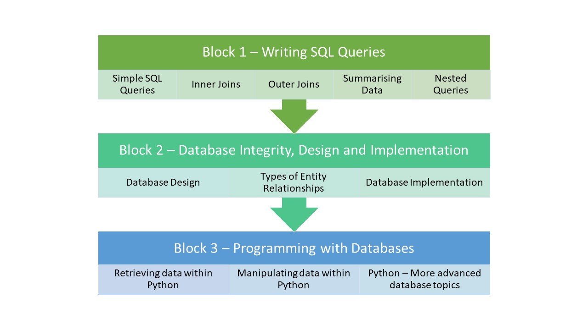

{: .no_toc }

# Tech Stacks - Databases COM417

### By the end of this unit, students will:
* Understand the importance and role of relational databases in modern IT systems
* Produce meaningful information from data in response to a reporting requirement
* Have a good understanding of the SQL language
* Understand the different types of entity relationships that exist
* Know how to ensure database integrity is maintained
* Learn how design a new database or extend an existing one
* Know how to implement a new database or changes to an existing one
* Have a good understanding of the Python programming language
* Know how to retrieve data from and manipulate data in a database from within a Python program
* Know how to develop database applications
* Be able to write a structured report informed by research

The Introduction to Databases module is split into three blocks:

### Block 1 - Retrieving data using SQL Queries

* Basic queries
* Functions
* Inner and Outer Joins
* Aggregation
* Comparing and combining result sets
* Nested queries 

### Block 2 - Design and implementation

* Database lifecycle
* Conceptual, logical and physical design
* Types of relationships
* ERD and EERD
* Generalisation and specialisation
* Types of constraints 
* Database Implementation
* Testing constraints

### Block 3 - Programming with Databases

* Writing programs with embedded SQL
* Transaction control
* Minimising SQL injection attacks
* Using Pandas to export and import data to a SQL database.

We use SQLite and Python for the delivery but teach ANSI standard SQL so it can be applied to any flavour of SQL. Our students get an introduction to Python in semester 1 and study Databases in semester 2 which builds on those Python skills and seems to work well.