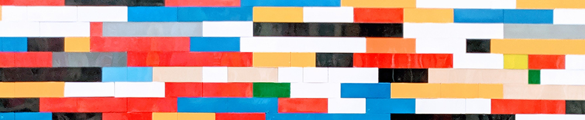

{: .no_toc }

# Computing Tech Stacks & Content Delivery

Photo by <a href="https://unsplash.com/@colorflores?utm_source=unsplash&utm_medium=referral&utm_content=creditCopyText">Omar Flores</a> on <a href="https://unsplash.com/s/photos/wall-lego?utm_source=unsplash&utm_medium=referral&utm_content=creditCopyText">Unsplash</a>
  

This section contains all the tech stacks and processes currently used on the Computing Subject Group's Modules